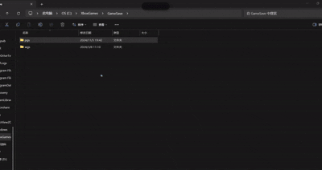
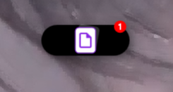
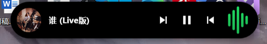
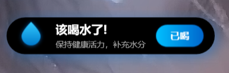

# 🏝️ WinIsland (Win灵动岛)

> **打破 Windows 沉闷交互的边界，单屏生产力的终极形态。**
> 
> WinIsland 不仅仅是 iOS 灵动岛的复刻，它是为 Windows 桌面生态量身打造的**智能中枢**。它以极简的 "胶囊" 形态悬浮于顶，却在每一次需要时，以惊艳的物理弹性动画展开无限可能。

## ✨ 功能演示 (Demo)

> **百闻不如一见。**  

## 🚀 为什么你需要 WinIsland？

### 1. 🌪️ 独创「文件引力黑洞」
**即使只有一块屏幕，也能享受多屏般的高效文件流转。**

*   **Drag & Drop 2.0**：当你拖拽文件至屏幕顶部，灵动岛瞬间化身紫色引力黑洞。
*   **暂存任意文件**：松手即吸入。文件被安全托管在岛内，不再占用你的鼠标和剪贴板。
*   **跨应用传输**：切换到微信、PS 或邮件窗口，从岛上轻轻一拖，文件即刻释放。
*   *告别 Alt+Tab 切来切去拖文件的狼狈。*

### 2. 🎵 沉浸式媒体接管
**让音乐不仅好听，而且好看。**

*   **全局兼容**：完美支持网易云音乐、Spotify、Apple Music 等主流播放器。
*   **视觉律动**：内置实时音频频谱分析，灵动岛会随着重低音的节奏跳动呼吸。
*   **打扰更少**：切歌、暂停，一切操作均在顶部微型窗口完成，无需离开当前工作区。

### 3. ⚡ 硬件级感知与通知
**比 Windows 原生通知更优雅，更懂你。**

*   **蓝牙/USB 监听**：AirPods 连接了？U盘拔出了？灵动岛会以优雅的 3D 翻转动画告知你，随后自动隐退。

### 4. 🧘 赛博养生助手

*   **智能喝水提醒**：工作再忙，也要照顾好身体。每隔一段时间，细腻的水滴动画会提醒你补充水分。
*   **Todo 速记**：不再遗忘闪念即逝的任务。

---

## 🎨 极致的工匠设计 (Premium Craft)

我们拒绝 Windows Forms 的廉价感。WinIsland 的每一像素都经过精心打磨：
*   **Spring Physics 引擎**：自研弹簧阻尼算法，窗口的每一次变大变小，都像果冻一样Q弹真实。
*   **Glassmorphism**：深邃的背景模糊与弥散光影，完美融入 Windows 11 设计语言。
*   **60FPS 流畅度**：基于 GPU 加速的渲染管线，拒绝掉帧与卡顿。

---

## 📥 如何安装

1. 下载最新 Release 包。
2. 解压并运行 `WinIsland.exe`。
3. **Enjoy!** 试着播放一首歌，或者把桌面上的文件“扔”进黑洞试试。

## ❤️ 参与贡献

WinIsland 是一个开源项目，我们需要你的创意！
如果你有好的想法或发现了 Bug，欢迎提交 Issue 或 PR。让我们一起重新定义 Windows 的桌面体验。

*Created with ❤️ by Antigravity*
